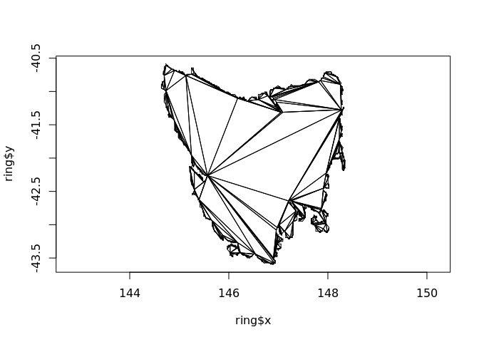

<!-- README.md is generated from README.Rmd. Please edit that file -->
[](https://www.tidyverse.org/lifecycle/#maturing) [](https://travis-ci.org/hypertidy/decido) [](https://travis-ci.org/hypertidy/decido) [](https://ci.appveyor.com/project/hypertidy/decido) [](https://codecov.io/github/hypertidy/decido?branch=master) [](https://cran.r-project.org/package=tidync)

decido
======

The goal of decido is to demonstrate a minimal R binding to the Mapbox library [earcut.hpp](https://github.com/mapbox/earcut.hpp).

This is to augment the JS version available in [rearcut](https://github.com/hypertidy/rearcut.git) (also an R wrapper of the JS version by Mapbox).

Installation
------------

You can install decido from with:

``` r
devtools::install_github("hypertidy/decido")
```

Development
-----------

Immediate needs:

-   clean up ability to specify holes
-   wrap around complex types of multiple polygons, etc.
-   tests!

See [rearcut](https://github.com/hypertidy/rearcut.git) for some approaches to the hole encoding. It's not hard, just rife with options. At the moment it seems best to stick close to how the JS earcut encodes them, and this translates very simply in C++.

Example
-------

This is a basic example of triangulating a single-ring polygon. The output is a vector of triplet indices defining each triangle.

``` r
library(decido)
x <- c(0, 0, 0.75, 1, 0.5, 0.8, 0.69)
y <- c(0, 1, 1, 0.8, 0.7, 0.6, 0)
earcut(x, y)
#>  [1] 1 0 6 6 5 4 4 3 2 1 6 4 4 2 1


plot(x, y)
polygon(x, y, lwd = 10)
apply(matrix(earcut(x, y), nrow = 3), 2, function(ind) polygon(cbind(x, y)[ind + 1, ], col = "firebrick"))
```


    #> NULL

Support for holes is provided by two required arguments `numholes` and `holes`. The holes are the starting index of each hole, here in C++ 0-based convention.

``` r
## hole starts at 9
x <- c(0, 0, 0.75, 1, 0.5, 0.8, 0.69, 0, 0.2,
      0.5, 0.5, 0.3, 0.2, 0.2)
y <- c(0, 1, 1, 0.8, 0.7, 0.6, 0, 0, 0.2,
      0.2, 0.4, 0.6, 0.4, 0.2)
ind <- earcut(x, y, holes = 8, numholes = 1)
plot(x, y, asp = 1)

xy <- cbind(x, y)
apply(matrix(ind, 3), 2, function(i) polygon(xy[i + 1, ]))
```


    #> NULL

``` r
library(oz)
oz_ring <- oz::ozRegion(states = FALSE)
ring <- oz_ring$lines[[6]]
plot(ring, pch = ".", asp = 1/cos(42 * pi/180))
indices <- earcut(ring$x, ring$y)
xy <- cbind(ring$x, ring$y)
apply(matrix(indices, nrow = 3), 2, function(ind) polygon(xy[ind + 1, ]))
```



    #> NULL

Performance
-----------

Compare timing of C++ versus JS implementations.

``` r
 rbenchmark::benchmark(rearcut::earcut(cbind(ring$x, ring$y)), decido::earcut(ring$x, ring$y))
                                    test replications elapsed relative
#2     decido::earcut(ring$x, ring$y)          100   0.064    1.000
#1 rearcut::earcut(cbind(ring$x, ring$y))          100   4.147   64.797
```

Beware!
-------

This is in active development and the functions will change.

No checking is done on input coordinates, so use at your own risk!

Please note that this project is released with a [Contributor Code of Conduct](CODE_OF_CONDUCT.md). By participating in this project you agree to abide by its terms.
