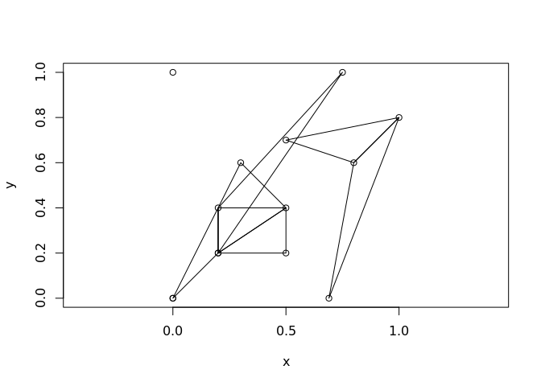

<!-- README.md is generated from README.Rmd. Please edit that file -->
earcut.cpp
==========

The goal of earcut.cpp is to demonstrate a minimal R binding to the Mapbox library [earcut.hpp](https://github.com/mapbox/earcut.hpp).

This is to augment the JS version available in [rearcut](https://github.com/hypertidy/rearcut.git) (also an R wrapper of the JS version by Mapbox).

Installation
------------

You can install earcut.cpp from with:

``` r
devtools::install_github("mdsumner/earcut.cpp")
```

Development
-----------

Immediate needs:

-   allow input of holes
-   wrap around complex types of multiple polygons, etc.
-   tests!

Example
-------

This is a basic example of triangulating a single-ring polygon. The output is a vector of triplet indices defining each triangle.

``` r
library(earcut.cpp)
x <- c(0, 0, 0.75, 1, 0.5, 0.8, 0.69)
y <- c(0, 1, 1, 0.8, 0.7, 0.6, 0)
earcut(x, y)
#>  [1] 1 0 6 6 5 4 4 3 2 1 6 4 4 2 1


plot(x, y)
polygon(x, y, lwd = 10)
apply(matrix(earcut(x, y), nrow = 3), 2, function(ind) polygon(cbind(x, y)[ind + 1, ], col = "firebrick"))
```


    #> NULL

``` r
library(oz)
oz_ring <- oz::ozRegion(states = FALSE)
ring <- oz_ring$lines[[6]]
plot(ring, pch = ".", asp = 1/cos(42 * pi/180))
indices <- earcut(ring$x, ring$y)
xy <- cbind(ring$x, ring$y)
apply(matrix(indices, nrow = 3), 2, function(ind) polygon(xy[ind + 1, ]))
```



    #> NULL

Beware!
-------

Only single ring polygons are supported currently. No checking is done on input coordinates, so use at your own risk!
