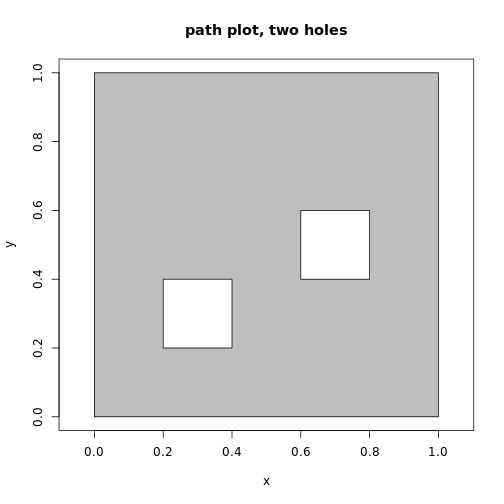
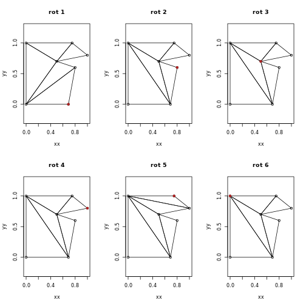

## Constrained triangulation of polygons

Decido aims to provide very fast constratined triangulations for polygons in R using a robust C++ library created by Mapbox. 

Constrained triangulation of polygons by ear clipping is an important
low-cost method for decomposing a polygon into triangles. Polygon triangulation is necessary for 3D visualization and many analytical techniques. Here *constrained* means **shape-preserving**, in the sense that every edge of the polygon will be include as the edge of a triangle in the result. 

Ear clipping (or cutting) must be applied to a *path-based* polygon that consists of only one island, with zero or more holes. Any multiple island polygons must be triangulation separately by this method. 

The better-known *Delaunay triangulation* is generally not shape-preserving as it works only on points, without knowledge of input line segments or polygon edges. Shape-preserving Delaunay or more commonly *near-Delaunay* triangulation is performed on a set of edges rather than paths, and can be
performed on multiple polygons at once. Holes require careful trimming of triangles after the decomposition is performed in this approach. 


## Example

This is a basic example of triangulating a single-ring polygon. The
output is a vector of triplet indices defining each triangle. 


```r
library(decido)
x <- c(0, 0, 0.75, 1, 0.5, 0.8, 0.69)
y <- c(0, 1, 1, 0.8, 0.7, 0.6, 0)
(ind <- earcut(cbind(x, y)))
#>  [1] 2 1 7 7 6 5 5 4 3 2 7 5 5 3 2


plot_ears(cbind(x, y), ind)
```


Support for holes is provided by the argument `holes`. The values are the starting index of each hole, here in R's 1-based convention. 


```r
## polygon with a hole
x <- c(0, 0, 0.75, 1, 0.5, 0.8, 0.69,
     0.2, 0.5, 0.5, 0.3, 0.2)
y <- c(0, 1, 1, 0.8, 0.7, 0.6, 0,
     0.2, 0.2, 0.4, 0.6, 0.4)
ind <- earcut(cbind(x, y), holes = 8)
plot_ears(cbind(x, y), ind)
```


The hole-specification is a little subtle, since usually R's functions
(polygon and polypath, and others) expect NA values to separate paths. 


Notice how the hole begins at index 8, hence `holes = 8` above, and `holes = c(8, 13)` below. 


```r
plot_ears(cbind(x, y), ind, col = "grey", border = NA)
text(x, y, labels = seq_along(x), pos = 2)
```


The method is subtle. 

This example adds a third polygon, a second hole in the island. 


```r
## add another hole
x <- c(0, 0, 0.75, 1, 0.5, 0.8, 0.69,
     0.2, 0.5, 0.5, 0.3, 0.2,
      0.15, 0.23, 0.2)
y <- c(0, 1, 1, 0.8, 0.7, 0.6, 0,
     0.2, 0.2, 0.4, 0.6, 0.4,
      0.65, 0.65, 0.81)
ind <- earcut(cbind(x, y), holes = c(8, 13))
plot_ears(cbind(x, y), ind, col = "grey")
```


## Comparing paths and triangles

This example defines a much simpler shape, the minimal shape able to
be decomposed to triangles (and not stay a triangle). 

A quadrilateral, with two holes that are open to each other allows the use of the same data, and we can tweak whether we wanted one hole or two. This is an important example used for validating early versions of this package. 


```r
x <- c(0, 0, 1, 1,
       0.4, 0.2, 0.2, 0.4,
       0.6, 0.8, 0.8, 0.6
)
y <- c(0, 1, 1, 0,
       0.2, 0.2, 0.4, 0.4,
       0.6, 0.6, 0.4, 0.4
)
ind <- decido::earcut(cbind(x, y), holes = c(5, 9))
plot_ears(cbind(x, y), ind, col = "grey")
title("triangle plot, two holes")
```


```r
plot_holes(cbind(x, y), holes = c(5, 9), col = "grey")
title("path plot, two holes")
```



```r

ind <- decido::earcut(cbind(x, y), holes = 5)
plot_ears(cbind(x, y), ind, col = "grey")
title("triangle plot, two holes as one")
```


```r
plot_holes(cbind(x, y), holes = 5, col = "grey")
title("path plot, two holes as one")
```


## A geographic example

For good measure we include a geographic example, a triangulation
of the mainland part of Tasmania from the `oz` package. 


```r
library(oz)
oz_ring <- oz::ozRegion(states = FALSE)
ring <- oz_ring$lines[[6]]
indices <- earcut(ring[c("x", "y")])
plot_ears(cbind(ring$x, ring$y), indices)
```


## Variants

The actual triangulation obtained depends on where the polygons start. This is complicated, because of the sheer number of possible variants, combinations of starting points among the island and its holes. 

Important "edge" cases are degeneracies, holes touching the island or each other, duplicated edges, intersecting edges, zero-length edges, holes actually external to islands, already existing triangles, and existing quadrilaterals (amongst others). We aren't going to explore those here, and we are reasonably confident that Mapbox has been presented with a rich enough pool of variant polygons to make its library pretty robust. There's no uniquely "correct" here either, different systems and standards will apply different rules and allow or choose differently. 


First a function to "rotate" coordinates to different start/end. 


```r
vecrot <- function(x, k) {
  if (k < 0 || k > length(x)) warning("k out of bounds of 'x' index")
  k <- k %% length(x)
  ## from DescTools::VecRot
  rep(x, times = 2)[(length(x) - k + 1):(2 * length(x) - k)]
}
```

Now plot each possible variant of definining the polygon ring by traversing the boundary anti-clockwise from 
a different starting vertex, shown as a filled point symbol. 


```r
x <- c(0, 0, 0.75, 1, 0.5, 0.8, 0.69)
y <- c(0, 1, 1, 0.8, 0.7, 0.6, 0)
(ind <- earcut(cbind(x, y)))
#>  [1] 2 1 7 7 6 5 5 4 3 2 7 5 5 3 2

plot_ears(cbind(x, y), ind)
points(x[1], y[1], pch = 19, col = "firebrick")
title("original")
```


```r
op <- par(mfrow = c(2, 3))
for (rot in head(seq_along(x), -1)) {
xx <- vecrot(x, rot); yy <- vecrot(y, rot)
ind <- earcut(cbind(xx, yy))
plot_ears(cbind(xx, yy), ind)
title(sprintf("rot %i", rot))
points(xx[1], yy[1], pch = 19, col = "firebrick")
}
```



```r
par(op)

```


Compare this to constrained Delaunay triangulation from the `RTriangle` package (not illustrated here 
but the result is that the *constrained* triangulation is different from all variants above, and the *conforming* triangulation inserts two points not included in the original data - these are called Steiner points). 

```R
library(sfdct)
library(sf)
xsf <- st_sfc(st_polygon(list(cbind(x, y)[c(seq_along(x), 1), ])))
plot(ct_triangulate(xsf, Y = TRUE)[1], col = NA)

## now a conforming Delaunay triangulation
plot(ct_triangulate(xsf, D = TRUE)[1], col = NA)

```

## Performance

Compare timing of C++ versus JS implementations. 


```R
 rbenchmark::benchmark(rearcut::earcut(cbind(ring$x, ring$y)), decido::earcut(ring$x, ring$y))
                                test replications elapsed relative
#2 decido::earcut(ring$x, ring$y)          100   0.064    1.000
#1 rearcut::earcut(cbind(ring$x, ring$y))  100   4.147   64.797
```


